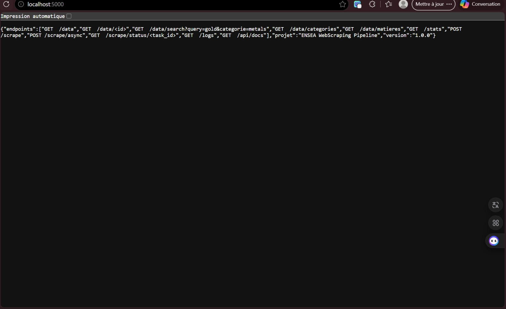
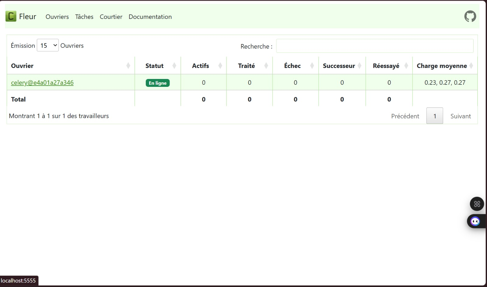
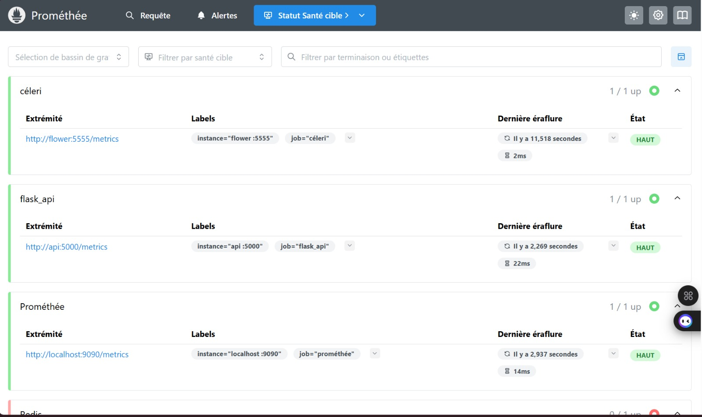
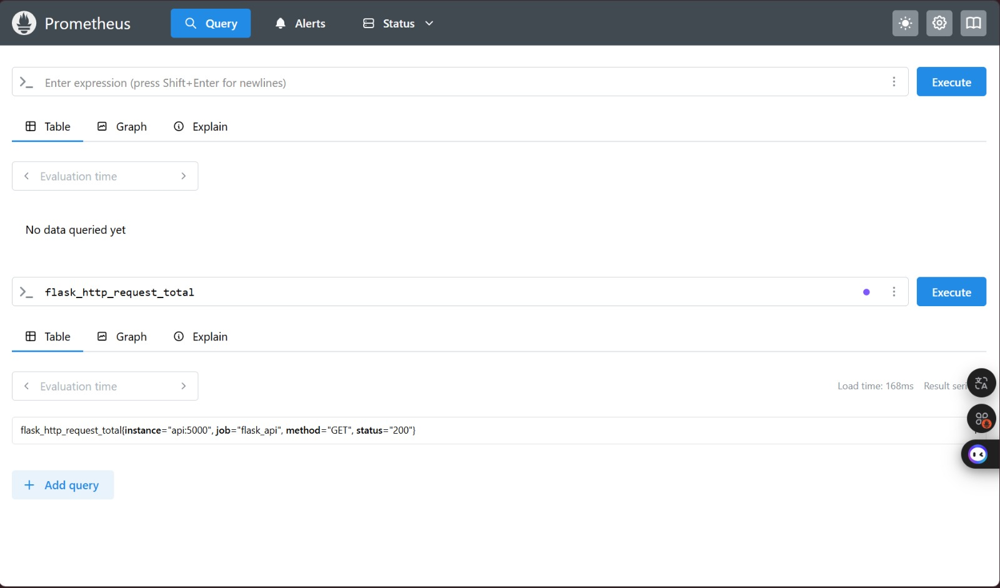
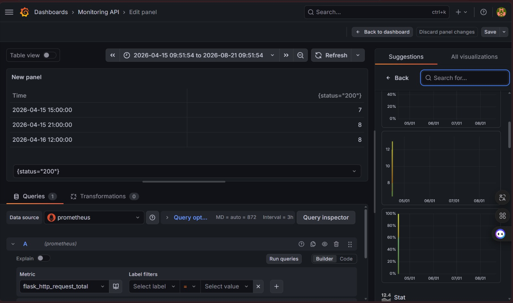
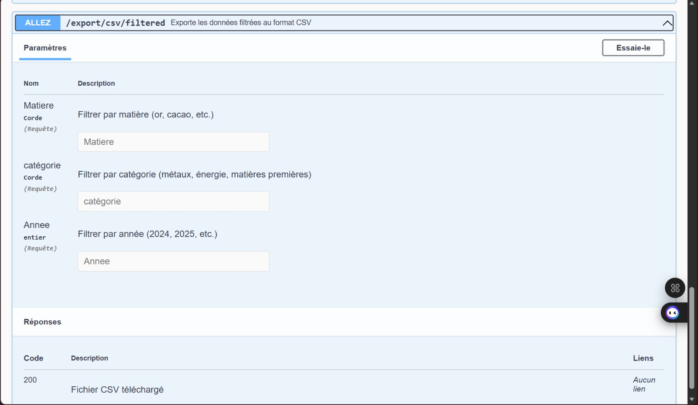

# 🌍 Web Scraping Pipeline - Matières Premières

[](https://github.com/sing-hins/webscraping-pipeline-groupe3)
[](https://www.docker.com/)
[](https://www.python.org/)
[](https://flask.palletsprojects.com/)
[](https://www.postgresql.org/)
[](https://docs.celeryq.dev/)

## 📌 Description du projet

Ce projet est un **pipeline complet de collecte et d'exploitation de données** sur les prix des matières premières (or, argent, cuivre, pétrole, cacao, café, blé, etc.). Il automatise l'ensemble du processus : du scraping web à la visualisation des données, en passant par le nettoyage, le stockage, l'exposition via une API REST, et le monitoring.

> **Projet académique** – ENSEA – Niveau **OR** atteint

---

## 👥 Membres et rôles

| Membre | Rôle | Responsabilités |
|--------|------|-----------------|
| **sing-hins** : SINGIBE HINSALBE | Data Engineer / Backend | Scraping, nettoyage, API |
| **angedoubleyao-droid** : YAO EVRARD | Backend Developer | API, base de données /  Grafana  |
| **znrissf-byte** : ZANIRA ISSOUFOU | DevOps / Monitoring | Docker, Celery, Prometheus|
---

## 🛠️ Technologies utilisées

| Catégorie | Technologies |
|-----------|--------------|
| **Scraping** | Selenium, BeautifulSoup |
| **Data** | Pandas, NumPy |
| **Base de données** | PostgreSQL, SQLAlchemy |
| **API** | Flask, Swagger/OpenAPI |
| **Conteneurisation** | Docker, Docker Compose |
| **Tâches asynchrones** | Celery, Redis, Flower |
| **Monitoring** | Prometheus, Grafana |
| **Tests** | Pytest |
| **Langage** | Python 3.11 |

---

## Données collectées

- **Matières** : gold, silver, copper, platinum, crude_oil, natural_gas, brent_crude, corn, wheat, coffee, cocoa, sugar
- **Volume** : 5 815 lignes après nettoyage
- **Période** : Données mensuelles historiques (1984 - 2026)
- **Source** : Macrotrends

---

## 📁 Architecture du projet

```bash
📦 webscraping-pipeline-groupe3/
│
├── 📁 api/
│   ├── 📁 static/
│   │   └── 📄 swagger.yaml
│   ├── 📄 __init__.py
│   └── 📄 app.py
│
├── 📁 db/
│   ├── 📄 import_data.py
│   ├── 📄 init_db.py
│   └── 📄 models.py
│
├── 📁 frontend/
│   └── 📄 index.html
│
├── 📁 monitoring/
│   └── 📄 prometheus.yml
│
├── 📁 scraper/
│   ├── 📄 __init__.py
│   ├── 📄 cleaner.py
│   ├── 📄 scraper.py
│   └── 📄 raw_data.json
│
├── 📁 tasks/
│   └── 📄 celery_tasks.py
│
├── 🐳 Dockerfile
├── 📦 docker-compose.yml
├── 📋 requirements.txt
├── 🔐 .env
└── 📖 README.md

```

## 🚀 Installation et lancement

### Prérequis

- [Docker](https://www.docker.com/products/docker-desktop/) et Docker Compose
- [Git](https://git-scm.com/)
- [Python 3.11+](https://www.python.org/) (optionnel, pour scripts locaux)

### Étapes d'installation

```bash
# 1. Cloner le dépôt
git clone https://github.com/sing-hins/webscraping-pipeline-groupe3.git
cd webscraping-pipeline-groupe3

# 2. Copier et configurer les variables d'environnement
cp .env.example .env
# Modifier .env si nécessaire (identifiants PostgreSQL, etc.)

# 3. Lancer tous les services Docker
docker-compose up -d --build

# 4. Initialiser la base de données
docker-compose exec api python -c "from db.models import init_db; init_db()"

# 5. Importer les données (5 815 lignes)
docker-compose exec api python db/import_data.py

# 6. Vérifier que tous les conteneurs tournent
docker ps

```

## Accès aux services

| Service | URL | Identifiant | Description |
|---------|-----|-------------|-------------|
| API REST | http://localhost:5000 | - | Points d'accès aux données |
| Swagger | http://localhost:5000/api/docs | - | Documentation interactive de l'API |
| Flower | http://localhost:5555 | - | Surveillance des tâches Celery |
| Prometheus | http://localhost:9090 | - | Collecte des métriques |
| Grafana | http://localhost:3000 | admin / admin | Dashboard de monitoring |
| Export CSV | http://localhost:5000/export/csv | - | Téléchargement des données |


## 📡 Endpoints de l'API

| Méthode | Endpoint | Description | Exemple |
|---------|----------|-------------|---------|
| `GET` | `/data` | Liste des prix | `/data?matiere=gold&limit=10` |
| `GET` | `/data/<id>` | Prix par ID | `/data/1` |
| `GET` | `/stats` | Statistiques | - |
| `GET` | `/export/csv` | Export CSV | - |
| `POST` | `/scrape/async` | Scraping asynchrone | - |


## API REST – Données JSON

Exemple de réponse de l'API sur http://localhost:5000/data

## Swagger – Documentation API
[Ajouter photo : swagger.png]
Documentation interactive de l'API sur http://localhost:5000/api/docs

## Flower – Surveillance Celery

Worker Celery en ligne et tâches traitées sur http://localhost:5555

## Prometheus – Métriques


Cible flask_api avec statut "UP" sur http://localhost:9090/targets


Requête flask_http_request_total avec résultat

## Grafana – Dashboard Monitoring

Dashboard Grafana avec métrique flask_http_request_total

Export CSV

Téléchargement du fichier CSV depuis http://localhost:5000/export/csv

Dashboard Frontend 


Visualisation interactive des prix sur http://localhost:8501